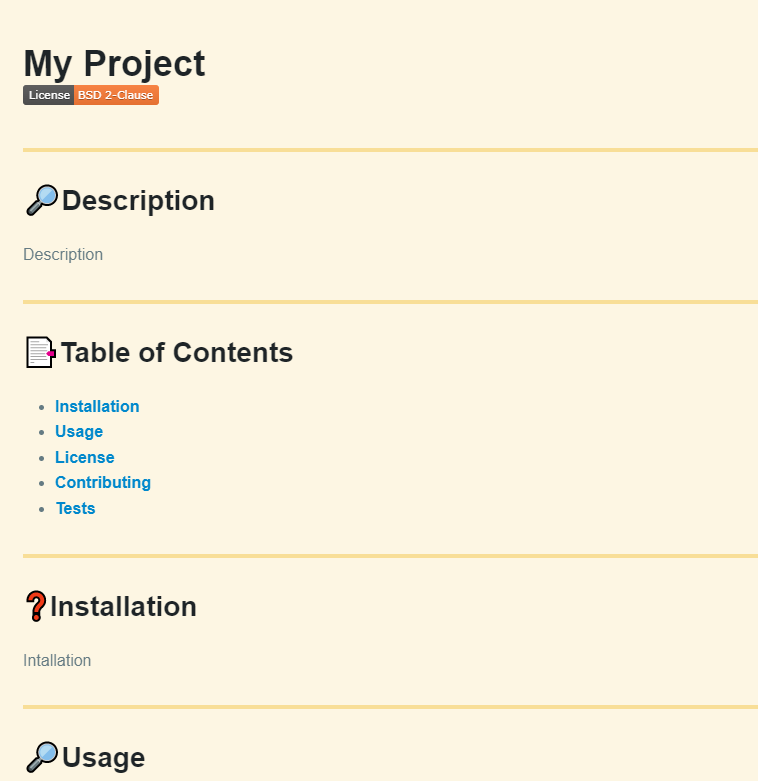

# readme-generator
 

## Description

Uses node.js with inquirer to use user inputs from command line entries to build a professional readme.

## Installation

N/A

## Usage

The reason behind the website is to display my ability to use node.JS along with remote and shipping modules in tandem with typical JS syntax. 

## License

MIT

## Credits

UDenver Bootcamp Course

## Website Screenshot
[Nick Fillip's Github Profile LINK](https://github.com/nfillip)

